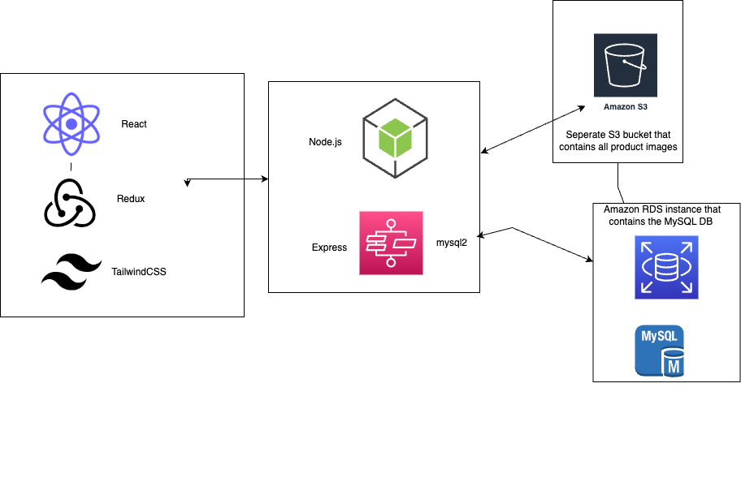

<!-- # Dekkikeisari Frontend

### Dekkikeisari is a feature-rich full-stack e-commerce application. The frontend is built using React, Redux, TypeScript, and Tailwind CSS, offering a modern and responsive user interface. The application provides product listing, filtering, user authentication, shopping cart functionality, and an admin panel for managing products, customers, and orders.

[Live Demo on Netlify](https://cerulean-marshmallow-946350.netlify.app/)
[Backend Repository](https://github.com/tommimaki/dekkikeisari-Backend)

## Key Features

- Product listing with category-based filtering
- User authentication (Sign Up and Sign In)
- User profile management
- Shopping cart functionality
- Admin panel for managing products, orders, and customers
- Responsive design for an optimized user experience on various devices

## Frontend Technologies and Libraries

- React: A JavaScript library for building user interfaces
- Redux: A state management library for JavaScript applications
- TypeScript: A typed superset of JavaScript that adds static types
- Tailwind CSS: A utility-first CSS framework for rapid UI development
- React Router DOM: Declarative routing for React
- React Icons: A library of popular icons for React projects
- React Modal: Accessible modal dialogs for React
- React Responsive Carousel: A responsive carousel component for React
- React Dropzone: A file-upload component for React
- React Collapse: A collapsible component for React
- Axios: A promise-based HTTP client for JavaScript
- ag-Grid: A high-performance data grid library for JavaScript

## License

MIT -->

# SkateShop Frontend Documentation

### The SkateShop frontend is built using React, Redux, TypeScript, and Tailwind CSS, offering a modern and responsive user interface for an e-commerce application.

## Table of Contents

- [Key Features](#key-features)
- [Frontend Technologies and Libraries](#frontend-technologies-and-libraries)
- [Live Demo and Backend Repository](#live-demo-and-backend-repository)
- [License](#license)

## Key Features

- Product listing with category-based filtering
- User authentication (Sign Up and Sign In)
- User profile management
- Shopping cart functionality
- Admin panel for managing products, orders, and customers
- Responsive design for an optimized user experience on various devices

## Frontend Technologies and Libraries

- React: A JavaScript library for building user interfaces
- Redux: A state management library for JavaScript applications
- TypeScript: A typed superset of JavaScript that adds static types
- Tailwind CSS: A utility-first CSS framework for rapid UI development
- React Router DOM: Declarative routing for React
- React Icons: A library of popular icons for React projects
- React Modal: Accessible modal dialogs for React
- React Responsive Carousel: A responsive carousel component for React
- React Dropzone: A file-upload component for React
- React Collapse: A collapsible component for React
- Axios: A promise-based HTTP client for JavaScript
- ag-Grid: A high-performance data grid library for JavaScript

## Live Demo and Backend Repository

- [Live Demo on Netlify](https://cerulean-marshmallow-946350.netlify.app/)
- [Backend Repository](https://github.com/tommimaki/dekkikeisari-Backend)

## License

MIT
